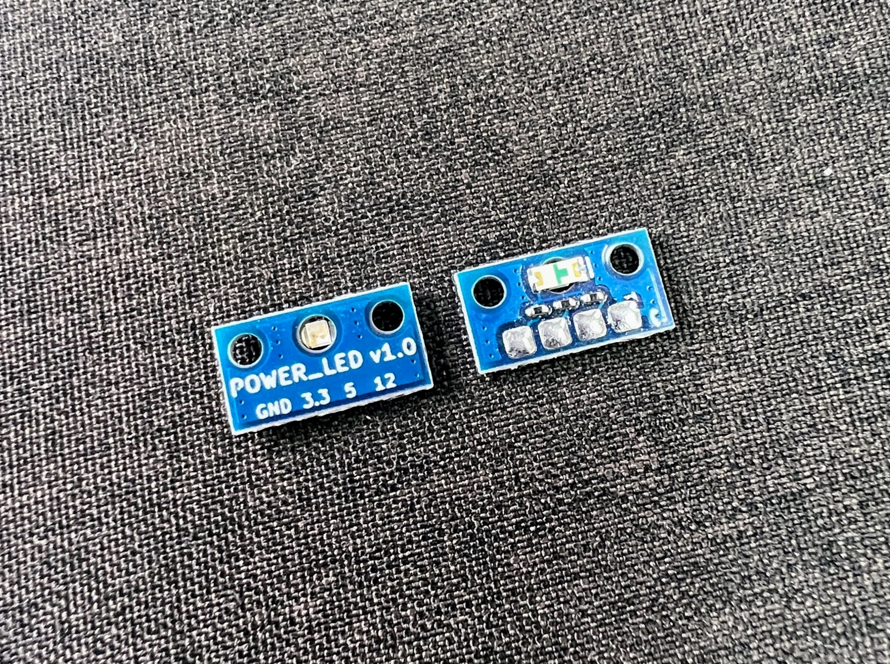
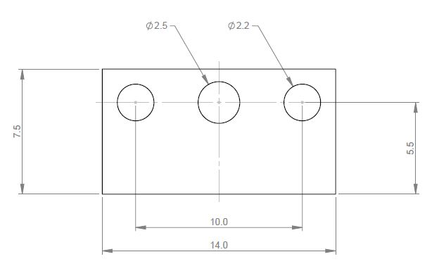

# POWER_LED v1.0

POWER_LED is a unique take on the traditional panel mounted LED design, utilising a PCB and reverse mount LED it can be flush mounted to any internal surface and provide excellent visibility to the external environment. 
It was originally designed as a power indicator light for combat robots, but is ideal for any application that requires a small panel-mount LED.

Designed and built in [Christchurch, New Zealand ](https://www.google.co.nz/maps/place/Christchurch+New+Zealand) by Connor Benton, visit [CB-Technology](https://www.cb-tech.co.nz/) for details.

## FEATURES
- Flush-mount design provides a secure mounting for high-impact environments
- Internal mounting protects the module from external impacts
- Small form factor and low profile design allows the LED to be tucked into tighter areas that simmilar products
- Single red LED chosen its visibility when contrast against the majority of environments
- Special thin PCB used to reduce weight
- Multiple supply options to optimise the light production given common input voltages

## SPECIFICATIONS
- **Dimensions:** 14.0x7.5x1.3 mm
- **Weight:** 0.2g *excluding wires or mounting fasteners*
- **Input Voltage:** 3V3, 5V, and 12V options
- **Current Consumption:** 10mA max
- **Mounting Fasteners:** M2

## INSTALLATION & OPERATION

The mounting + viewing hole pattern is as per the diagram below: 

Choose your supply voltage and connect it to the respective input. It is recommended to connect the Power_LED as close the power switch as possible. 
When connecting the power supply, ensure the direction is correct and do not connect multiple power supplies simualanerously. 
If either of these are done, it could damage the electrical componets, including the POWER_LED and/or whatever is supplying the power.  
